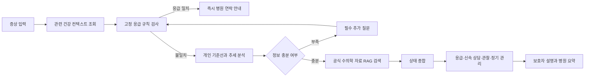
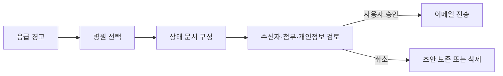

## TL;DR

PetCare AI는 보호자가 반려동물의 식사, 음수, 배변, 체중, 활동, 증상, 진료 및 투약 기록을 지속적으로 축적하도록 돕고, 해당 반려동물의 개인 기준선과 비교해 평소와 다른 변화를 조기에 발견하는 건강관리 AI Agent다.

수치 변화와 응급 징후는 결정론적 규칙과 통계 로직이 먼저 판단한다. LLM은 자연어 기록 구조화, 필요한 추가 질문, 공식 수의학 자료 검색, 보호자용 설명, 병원 전달용 요약을 담당한다.

PetCare AI는 질병을 확정 진단하거나 약물과 투약량을 처방하지 않는다.

---

## 1. 배경과 문제

보호자는 병원 방문 사이의 일상 변화를 가장 많이 관찰하지만, 기록이 메모, 사진, 기억에 흩어져 있어 다음 내용을 정확하게 전달하기 어렵다.

- 증상이 언제 시작되었는지
- 평소 대비 얼마나 달라졌는지
- 여러 변화가 동시에 나타났는지
- 최근 체중, 식사량, 활동량이 어떻게 변했는지
- 기존 질환, 복용약, 알레르기와 관련이 있는지
- 지금 병원에 가야 하는지, 관찰해도 되는지

반려동물은 자신의 상태를 직접 설명할 수 없고, 보호자는 단일 증상만으로 위험도를 판단하기 어렵다.

일반적인 AI 챗봇은 해당 반려동물의 장기 건강기록을 알지 못하며, 출처가 불명확하거나 과도하게 안심시키는 답변을 제공할 수 있다.

### 핵심 문제

> 보호자는 반려동물의 평소 상태와 현재 변화를 근거로, 지금 필요한 행동과 병원에 전달할 정보를 안전하고 빠르게 알 수단이 부족하다.
>

### PetCare AI가 해결하는 흐름

1. 일상 건강기록 누적
2. 개체별 개인 기준선 생성
3. 이상 변화 및 복합 신호 탐지
4. 부족한 정보에 대한 추가 질문
5. 검수된 수의학 자료 검색
6. 위험 단계 분류
7. 보호자 행동 안내
8. 병원 전달용 요약 생성
9. 예방접종, 재진, 투약 일정 관리

---

## 2. 제품 원칙

1. **수의사를 대체하지 않는다.**
질병을 확정하거나 치료를 지시하지 않는다.
2. **응급 안전 규칙이 LLM보다 우선한다.**
3. **일반 평균보다 개인 기준선을 우선한다.**
4. **사용자 입력, 시스템 계산, 외부 문서 근거를 구분한다.**
5. **의료적 설명에는 출처와 문서 버전을 표시한다.**
6. **사용자 승인 없이 의료 문서 정보를 확정하지 않는다.**
7. **사용자 승인 없이 병원에 이메일을 전송하지 않는다.**
8. **건강정보는 최소 수집, 최소 전송, 최소 보존한다.**
9. **정보가 부족하면 정상 판정 대신 추가 질문 또는 상담 권고를 한다.**

---

## 3. 목표와 성공 지표

아래 수치는 MVP 검증용 제안값이며 수의사 자문, 사용자 테스트, 부하 테스트 후 확정한다.

| 목표 | 지표 | 측정 방법 | MVP 기준 |
| --- | --- | --- | --- |
| 기록 습관 형성 | 주간 기록 지속률 | 가입 후 4주 중 3주 이상 기록한 사용자 비율 | 40% 이상 제안 |
| 자연어 구조화 품질 | 필드 추출 정확도 | 골든셋 대비 Precision/Recall | 핵심 필드 F1 0.90 이상 |
| 추세 계산 신뢰성 | 계산 정확도 | 결정론적 테스트 결과 비교 | 100% |
| 응급 안전 | 응급 규칙 탐지율 | 수의사 검수 안전 테스트셋 | 누락 0건 |
| 과도한 안심 방지 | 거짓 정상 판정 수 | 안전 평가셋 검수 | 0건 |
| 근거 신뢰성 | 인용 정확도 | 답변 주장과 근거 일치율 | 95% 이상 제안 |
| 병원 상담 준비 | 요약 완성률 | 필수 항목 채움 비율 | 90% 이상 제안 |
| 기록 사용성 | 기록 완료 시간 | 사용성 테스트 | 중앙값 2분 이내 |
| 일반 응답 성능 | P95 응답시간 | 운영 Trace | 10초 이내 제안 |
| 응급 반응 속도 | 최초 응급 경고 시간 | UI 이벤트 | 2초 이내 제안 |
| 개인정보 보호 | 원문 건강정보의 LangSmith 전송 | Trace 감사 | 0건 |

### 배포 게이트

- 응급 테스트 누락 0건
- 확정 진단 표현 0건
- 임의 처방 표현 0건
- 필수 인용 누락 0건
- 출력 스키마 준수율 100%
- 직접식별정보가 LangSmith Trace에 남는 사례 0건

---

## 4. 비목표

MVP에서는 다음 기능을 제공하지 않는다.

- 사진이나 채팅만으로 질병 확정
- 약물 추천
- 투약량 변경
- 수의사의 진료를 대체하는 자동 의료행위
- 병원 EMR 완전 자동 연동
- 진단서 OCR 결과의 자동 확정
- 사용자 승인 없는 병원 이메일 전송
- 모든 동물 종 지원
- 실시간 병원 운영 여부 자체 판단
- 웨어러블과 스마트 급식기 연동
- 사진과 영상 기반 진단 보조
- 보험 청구
- 병원 예약 및 결제

---

## 5. 대상 사용자

| 사용자 | 상황 | 핵심 니즈 |
| --- | --- | --- |
| 일상 관리형 보호자 | 식사, 배변, 활동을 꾸준히 기록 | 빠른 기록, 추세 확인 |
| 증상 대응형 보호자 | 갑작스러운 구토, 무기력 등 발생 | 안전한 추가 질문, 행동 단계 |
| 만성질환 보호자 | 약, 체중, 재진 관리 필요 | 장기 기록, 일정 누락 방지 |
| 병원 방문 준비형 보호자 | 증상 경과 설명이 어려움 | 병원 전달용 구조화 요약 |
| 운영 관리자 | 문서, 안전 규칙, 평가 관리 | 버전 및 품질 추적 |

### 사용자 스토리

- US-01: 보호자로서 자연어 일기를 쓰면 건강 항목으로 자동 정리하고 싶다.
- US-02: 오늘 상태가 최근 7일과 30일의 평소 상태와 얼마나 다른지 알고 싶다.
- US-03: 증상을 입력하면 필요한 질문만 받고 위험 단계를 알고 싶다.
- US-04: 응급 가능성이 있으면 일반 설명보다 먼저 병원 연락 안내를 받고 싶다.
- US-05: 진단서 PDF를 업로드하고 추출 결과를 직접 확인하고 수정하고 싶다.
- US-06: 병원에 전달할 증상 경과와 변화량을 문서로 만들고 싶다.
- US-07: 응급 시 상태 요약을 검토한 뒤 병원에 이메일로 보내고 싶다.
- US-08: 예방접종, 재진, 투약 일정을 관리하고 싶다.
- US-09: 운영자로서 사용된 문서와 안전 규칙 버전을 추적하고 싶다.

---

## 6. 핵심 사용자 흐름

### 6.1 일상 기록

### 6.2 AI 상태 체크

### 6.3 병원 이메일 전송

---

## 7. 기능 요구사항

| ID | 기능 | 우선순위 |
| --- | --- | --- |
| F-01 | 반려동물 프로필 등록 및 수정 | P0 |
| F-02 | 자연어 건강일기 구조화 | P0 |
| F-03 | 구조화 기록 검토 및 저장 | P0 |
| F-04 | 개인 기준선 및 추세 분석 | P0 |
| F-05 | AI 상태 체크 | P0 |
| F-06 | 응급 규칙 및 즉시 안내 | P0 |
| F-07 | 공식 수의학 자료 기반 RAG | P0 |
| F-08 | 병원 전달용 요약 | P0 |
| F-09 | 진료문서 PDF 등록 | P0 |
| F-10 | 응급 상태 이메일 전송 | P1 |
| F-11 | 예방접종, 재진, 투약 일정 | P1 |
| F-12 | 관리자 문서 및 규칙 관리 | P1 |
| F-13 | LangSmith 관측 및 평가 | P0 |
| F-14 | 다중 반려동물 전환 | P1 |
| F-15 | 사진 및 파일 첨부 보관 | P2 |

---

## 8. AI Agent 요구사항

### 자율 수준

PetCare AI는 정해진 단계와 분기를 따르는 워크플로형 Agent다.

- 위험도가 높을수록 Agent 자율성을 줄인다.
- 응급 규칙은 코드로 고정한다.
- LLM은 후보와 설명을 생성한다.
- 의료 사실을 LLM이 최종 확정하지 않는다.
- 이메일과 진단서 정보는 사용자 승인을 거친다.

### Agent 구성

| Agent 또는 서비스 | 책임 |
| --- | --- |
| Health Orchestrator | 전체 실행 순서와 분기 관리 |
| Context Agent | 프로필, 최근 24시간·7일·30일 기록 조회 |
| Trend Analysis | 변화율, 이동 중앙값, 복합 신호 계산 |
| Safety Agent | 응급 규칙과 금지 표현 검사 |
| RAG Agent | 공식 수의학 문서 검색과 재정렬 |
| Summary Agent | 병원 전달용 요약 생성 |
| Reminder Agent | 예방접종, 구충, 재진, 투약 일정 관리 |
| Document Parser | PDF의 주요 정보 추출 |
| Citation Validator | 답변과 인용 근거 일치 검사 |

### 허용되는 행동

- 건강기록 구조화 후보 생성
- 필요한 추가 질문 생성
- 근거 기반 설명 생성
- 위험 단계 후보 생성
- 병원 전달용 요약 초안 생성

### 금지되는 행동

- 질병 확정
- 약물과 용량 변경
- 기록에 없는 사실 생성
- 불충분한 정보로 정상 판정
- 사용자 승인 없는 이메일 전송
- 업로드 문서 내부의 지시문 실행
- 검수되지 않은 웹 문서를 의료 근거로 사용

---

## 9. 위험 단계

| 단계 | 정의 | 기본 행동 |
| --- | --- | --- |
| 응급 | 생명 위협 가능성이 있는 고정 규칙 일치 | 즉시 동물병원 연락 |
| 신속 상담 | 개인 기준선의 지속적 이상 또는 복합 신호 | 당일 또는 빠른 상담 |
| 관찰 | 현재 응급 근거는 없지만 경과 확인 필요 | 관찰 항목과 악화 조건 제공 |
| 정기 관리 | 예방, 생활관리, 일정 중심 | 예방접종과 정기검진 안내 |

구체적인 규칙과 임계치는 수의사 검수 후 확정한다.

---

## 10. 비기능 요구사항

### 개인정보와 보안

- 건강정보와 진료문서는 민감정보로 취급한다.
- 저장 및 전송 시 암호화한다.
- LangSmith에는 최소 비식별 메타데이터만 전송한다.
- 원본 문서 접근 권한과 보존기간을 분리한다.
- 이메일 전송 전에 수신자와 첨부 정보를 표시한다.
- 데이터 조회, 수정, 전송 이력을 기록한다.

### 안전성

- 응급 판단은 LLM 단독 출력에 의존하지 않는다.
- 의료 기준은 검수된 문서와 규칙 버전에 연결한다.
- 충분한 근거가 없으면 “정상”, “문제없음”을 사용하지 않는다.
- 생성 답변은 최종 Safety Agent 검사를 거친다.

### 성능과 접근성

- 응급 규칙은 RAG 호출 전에 실행한다.
- 추세 계산은 동일 입력에 동일 결과를 반환해야 한다.
- 문서 파싱과 임베딩은 비동기 처리할 수 있다.
- 모바일 화면을 우선한다.
- 색상만으로 위험 단계를 구분하지 않는다.
- WCAG 2.1 AA를 지향한다.

---

## 11. 리스크

| 리스크 | 완화 방법 |
| --- | --- |
| 응급 징후 누락 | 고정 규칙, 수의사 검수, 회귀 테스트 |
| 과도한 안심 | 금지 표현 검사, 최종 Safety Agent |
| 기록 부족으로 잘못된 추세 | 데이터 부족 상태 및 누락률 표시 |
| 진단서 추출 오류 | 원문 위치, 신뢰도, 사용자 확인 |
| 부적절한 근거 사용 | 허용 문서 목록과 버전 관리 |
| 개인정보 유출 | 최소 전송, 암호화, 접근통제 |
| 병원 운영정보 오류 | 출처와 갱신시각 표시 |
| LLM 비용과 지연 | 컨텍스트 최소화, 캐시, 모델 라우팅 |
| 알림 피로도 | 중요도와 알림 빈도 제한 |

---

## 12. 마일스톤

| 단계 | 산출물 | 완료 기준 |
| --- | --- | --- |
| Phase 0 | 핵심 시나리오, 안전 범위, 데이터 필드 | 수의사 승인 |
| Phase 1 | 프로필, 건강일기, SQLite, 추세 | 기록 E2E 통과 |
| Phase 2 | Agent, RAG, 추가 질문, 병원 요약 | 인용 포함 응답 |
| Phase 3 | 응급 규칙, LangSmith, 평가셋 | 배포 게이트 통과 |
| Phase 4 | 사용자 및 수의사 검증 | P0 결함 해소 |
| Phase 5 | 제한 베타 | 운영 지표 수집 가능 |
