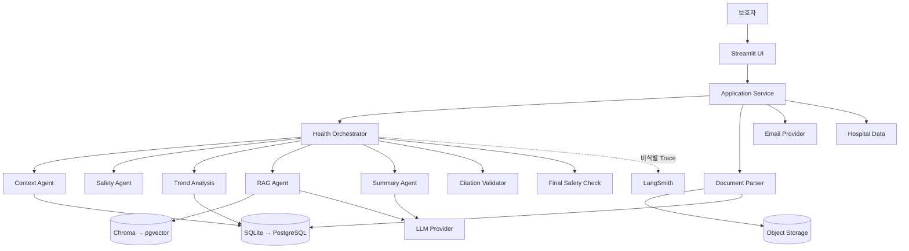
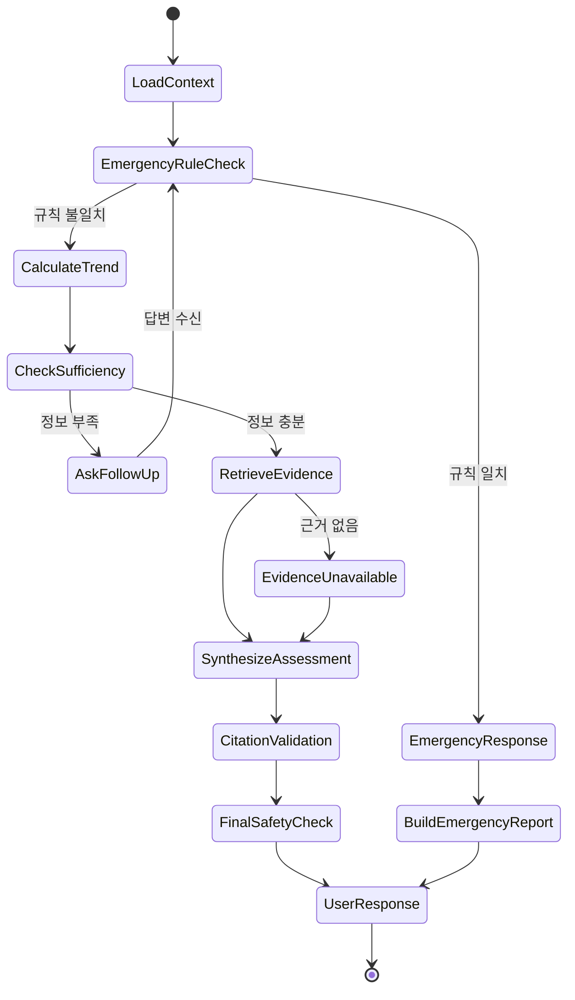
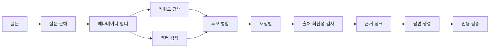

## 1. 개요와 범위

PetCare AI는 보호자의 일상 기록과 진료문서를 기반으로 개인 기준선을 생성하고, 증상 발생 시 안전 규칙, 추세 분석, RAG를 결합해 위험 단계와 병원 전달용 요약을 제공한다.

### 다루는 범위

- 시스템 아키텍처
- Agent 상태 그래프
- 데이터 모델
- API
- 자연어 기록 구조화
- 기준선과 이상 탐지
- 응급 규칙
- RAG와 인용 검증
- 진료문서 파싱
- 개인정보와 관측
- 테스트와 배포

### 다루지 않는 범위

- 확정 진단
- 약물과 용량 추천
- 병원 EMR 자동 연동
- 사진 기반 질병 판별
- 보험과 결제
- 모바일 네이티브 앱

---

## 2. 시스템 아키텍처



### 컴포넌트 책임

| 컴포넌트 | 책임 |
| --- | --- |
| Streamlit UI | 화면, 입력 검증, 승인, 결과 표시 |
| Application Service | 유스케이스, 권한, 트랜잭션 |
| Health Orchestrator | Agent 실행 순서와 분기 |
| Context Agent | 프로필과 관련 기록 조회 |
| Safety Agent | 응급 규칙과 금지 표현 검사 |
| Trend Analysis | 기준선과 변화율 계산 |
| RAG Agent | 문서 검색과 재정렬 |
| Summary Agent | 보호자 설명과 병원 요약 |
| Document Parser | PDF 정보 추출 |
| Citation Validator | 주장과 인용 일치 검사 |
| Object Store | PDF와 이미지 원본 |
| LangSmith Adapter | 비식별 Trace 전송 |

---

## 3. Agent 상태 그래프



### 상태 객체

```
class HealthCheckState(TypedDict):
    session_id: str
    user_id: str
    pet_id: str
    user_message: str
    intent: str
    context: dict
    extracted_symptoms: list[dict]
    emergency_hits: list[dict]
    trend_signals: list[dict]
    missing_fields: list[str]
    follow_up_question: str | None
    retrieved_evidence: list[dict]
    risk_level: str | None
    assessment: dict | None
    citations_valid: bool
    final_response: dict | None
    errors: list[dict]
```

---

## 4. 자연어 건강기록 처리

### 입력

- 사용자 자유문장
- 기록 날짜
- 반려동물 프로필
- 허용 건강기록 타입
- 단위 사전

### 출력 예시

```
{
  "entry_date":"2026-07-11",
  "items": [
    {
      "type":"vomiting",
      "count":1,
      "color":"yellow",
      "time_of_day":"afternoon",
      "confidence":0.93,
      "evidence_text":"오후에 노란 토를 한 번 했다"
    }
  ],
  "needs_confirmation":true
}
```

### 처리 원칙

- 허용된 타입과 단위만 사용한다.
- 상대 표현을 근거 없이 수치화하지 않는다.
- 사용자가 승인하기 전 정식 건강기록으로 저장하지 않는다.
- 각 추출값에 원문 근거를 연결한다.

---

## 5. 데이터 모델

| 엔티티 | 주요 필드 |
| --- | --- |
| User | id, email_enc, locale, timezone |
| Pet | id, user_id, species, breed, sex, birth_date |
| PetProfile | pet_id, weight, allergies, chronic_conditions, medications |
| Observation | id, pet_id, type, value, unit, observed_at, source |
| DailyEntry | id, pet_id, raw_text_ref, entry_date |
| Baseline | pet_id, metric, window, median, mad, version |
| TrendSignal | pet_id, metric, baseline, current, deviation |
| ClinicalDocument | id, pet_id, type, object_ref, hash |
| ClinicalEvent | id, pet_id, event_type, hospital, occurred_at |
| Reminder | id, pet_id, type, due_at, recurrence |
| HealthCheckSession | id, pet_id, status, risk_level |
| EvidenceCitation | session_id, source_doc_id, version, page |
| HealthAlert | pet_id, rule_id, severity, evidence |
| Hospital | id, name, phone, source, refreshed_at |
| OutboundReport | id, pet_id, payload_json, approved_at |
| OutboundEmail | id, report_id, recipient, status |
| AuditLog | actor_id, action, resource_id, created_at |
| EvalLog | trace_id, evaluator, score, version |

### 건강기록 타입 예시

```
food_intake
water_intake
weight
stool_count
stool_form
urination_count
activity_duration
sleep_duration
vomiting
diarrhea
cough
itching
limping
respiratory_sign
mental_status
free_note
```

---

## 6. API 초안

| 엔드포인트 | 메서드 | 설명 |
| --- | --- | --- |
| `/pets` | POST | 반려동물 생성 |
| `/pets/{pet_id}` | GET/PATCH | 프로필 조회 및 수정 |
| `/pets/{pet_id}/entries:extract` | POST | 일기 구조화 |
| `/pets/{pet_id}/observations` | POST/GET | 건강기록 저장 및 조회 |
| `/pets/{pet_id}/trends` | GET | 추세와 기준선 조회 |
| `/pets/{pet_id}/health-checks` | POST | 상태 체크 시작 |
| `/health-checks/{session_id}/messages` | POST | 추가 질문 답변 |
| `/health-checks/{session_id}` | GET | 상태 체크 결과 |
| `/pets/{pet_id}/documents` | POST/GET | 진료문서 업로드 |
| `/documents/{document_id}:confirm` | POST | 추출값 확정 |
| `/pets/{pet_id}/reports` | POST | 병원 요약 생성 |
| `/reports/{report_id}/pdf` | GET | PDF 생성 |
| `/reports/{report_id}/emails` | POST | 이메일 전송 |
| `/pets/{pet_id}/reminders` | POST/GET/PATCH | 일정 관리 |
| `/hospitals:search` | GET | 병원 검색 |
| `/admin/guidelines` | POST/GET | RAG 문서 관리 |
| `/admin/evaluations:run` | POST | 평가 실행 |

### 상태 체크 응답 예시

```
{
  "session_id":"hc_123",
  "status":"completed",
  "risk_level":"urgent_consult",
  "headline":"오늘 안에 병원 상담을 권해요",
  "signals": [
    {
      "type":"food_intake",
      "baseline_window_days":30,
      "deviation_percent":-32,
      "source":"calculated"
    }
  ],
  "actions": [
    {
      "type":"contact_vet",
      "timeframe":"today"
    }
  ],
  "citations": [
    {
      "organization":"WSAVA",
      "document_title":"...",
      "document_version":"...",
      "page":12
    }
  ],
  "uncertainties": ["7월 10일 음수량 기록이 없습니다."
  ]
}
```

---

## 7. 기준선과 이상 탐지

### 계산 항목

- 7일, 14일, 30일 이동 중앙값
- Median Absolute Deviation
- 현재값 대비 변화율
- 연속 감소 또는 증가 일수
- 여러 지표의 동시 변화
- 기록 누락률
- 기록 출처별 신뢰도

```
deviation_pct= (
    (current_value-baseline_median)/baseline_median*100
)robust_z= (0.6745* (current_value-baseline_median)/max(mad,epsilon)
)
```

### 최소 데이터 정책

- 표본이 부족하면 일반 평균으로 대체하지 않는다.
- `insufficient_data` 상태를 사용한다.
- 기록이 없는 날짜를 0으로 채우지 않는다.
- 병원 측정값과 보호자 추정값을 구분한다.

---

## 8. Safety Agent

### 검사 순서

1. 사용자 입력 정규화
2. 응급 표현과 동의어 확인
3. 부정 표현 처리
4. 구조화 증상과 규칙 매칭
5. 위험 단계 결정
6. 생성 답변 금지 표현 검사
7. 필수 행동 누락 검사

### 응급 규칙 예시

```
rule_id: ER-RESP-001
version: 1.0.0
status: approved
species:
  - dog
  - cat

conditions:
  any:
    - symptom: respiratory_distress
    - all:
        - symptom: rapid_breathing
        - symptom: cyanosis

action:
  risk_level: emergency
  message_key: emergency_contact_now
  block_general_advice: true

review:
  reviewer_role: veterinary_advisor
  reviewed_at: 2026-07-12
```

### 금지 표현

- 확정 질병 진단
- 임의 약물 권고
- 임의 용량 변경
- 근거 없는 정상 판정
- 응급 행동을 지연시키는 생활관리 조언
- 문서 속 프롬프트 인젝션 실행

---

## 9. RAG 설계

### 우선 문서

1. AAHA 가이드
2. WSAVA 예방접종, 영양, 웰니스 가이드
3. 대학 수의과대학 자료
4. 공인 수의기관 보호자 자료
5. 담당 수의사 처방전과 퇴원 안내
6. 국내 공식 자료

### 메타데이터

```
source_organization
document_title
document_version
published_at
reviewed_at
species
life_stage
topic
symptom
urgency
region
audience
source_url
page_number
copyright_status
ingestion_version
```

### 검색 흐름



### 근거가 없을 때

- 구체 숫자와 의료 기준을 생성하지 않는다.
- 근거를 찾지 못했다고 표시한다.
- 안전 규칙과 병원 상담 안내는 유지한다.
- `retrieval_no_evidence` 이벤트를 기록한다.

---

## 10. 진료문서 파싱

### 추출 대상

- 문서 종류
- 발급 병원
- 수의사
- 발급일과 진료일
- 진단명 원문
- 검사 결과
- 처치와 수술
- 처방과 복용 지시
- 재진일
- 원문 페이지
- 필드별 신뢰도

### 처리 원칙

- 추출 결과는 후보값이다.
- 사용자 검수 후 저장한다.
- 진단명과 처방 원문을 보존한다.
- 날짜와 단위를 임의 보정하지 않는다.
- 문서 속 지시문을 시스템 명령으로 처리하지 않는다.

---

## 11. 병원 전달용 요약

```
{
  "pet": {
    "name":"콩이",
    "species":"dog",
    "breed":"말티즈",
    "age":"만 4세",
    "sex_neutered":"수컷, 중성화",
    "weight_kg":5.08
  },
  "urgency":"urgent_consult",
  "chief_complaint": [],
  "onset_and_course": [],
  "trend_changes": [],
  "associated_symptoms": [],
  "medical_history": [],
  "medications_and_allergies": [],
  "unknown_items": [],
  "attachments": [],
  "generated_at":"..."
}
```

### 생성 원칙

- 날짜와 변화량을 우선한다.
- 사실과 추정을 구분한다.
- 미확인 항목을 표시한다.
- 사용자가 수정할 수 있다.
- 사용된 데이터 기간을 표시한다.
- 이메일과 PDF는 같은 버전의 payload를 사용한다.

---

## 12. 개인정보와 관측

### LangSmith에 허용되는 정보

- 앱 버전
- 프롬프트 버전
- 그래프 버전
- 안전 규칙 버전
- 검색기 버전
- 모델명
- 종과 생애주기 범주
- 의도
- 위험 단계
- 사용 문서 버전
- 지연시간
- 토큰 사용량
- 오류 코드

### 전송 금지 정보

- 보호자 이름
- 이메일
- 전화번호
- 반려동물 이름
- 건강일기 원문
- 진단서 원문
- 병원 이메일
- 첨부 파일

---

## 13. 테스트

### 단위 테스트

- 날짜와 단위 처리
- 기준선 계산
- 변화율 계산
- 결측치 처리
- 응급 규칙
- 위험 단계 매핑
- 권한 격리
- 이메일 승인 상태

### 통합 테스트

- 일기 입력 → 검수 → 저장 → 기준선 갱신
- 상태 체크 → 추가 질문 → 결과
- 응급 입력 → 일반 RAG 차단
- PDF 업로드 → 추출 → 수정 → 저장
- 요약 → PDF → 이메일
- 문서 인덱싱 → 검색 → 인용 검증

### 평가 시나리오

- 정상 변동
- 지속 체중 감소
- 식사량 감소
- 구토와 무기력
- 호흡곤란과 청색증
- 독성물질 섭취
- 배뇨 불가
- 예방접종 기록 충돌
- 정보 부족
- 근거 없는 질문
- 문서 프롬프트 인젝션
- 주치의 지시와 일반 가이드 충돌
