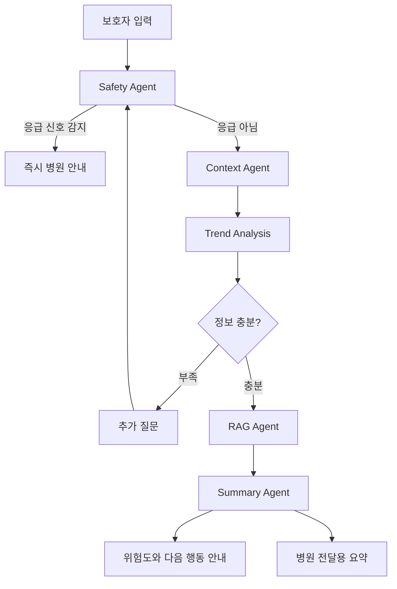

# PetCare AI 프로젝트 정리

## 1. 서비스 정의

PetCare AI는 보호자의 일상 기록과 진단서 정보를 바탕으로 반려동물의 개인 기준선을 만들고, 평소와 다른 이상 신호를 감지해 다음 행동과 병원 전달용 요약을 제공하는 건강관리 AI Agent 서비스이다.

핵심은 일반적인 반려동물 건강 지식을 답변하는 것이 아니라, "우리 반려동물의 평소 기록"을 기준으로 현재 변화를 판단하는 것이다.

## 2. 핵심 문제

보호자는 매일 반려동물을 가까이에서 관찰한다. 식사량, 활동량, 체중, 구토, 설사, 배변 상태처럼 중요한 정보도 대부분 알고 있다. 하지만 이 정보는 사진, 메모, 기억 속에 흩어져 있어 병원에서 정확한 수치와 기간으로 설명하기 어렵다.

PetCare AI가 해결하려는 핵심 문제는 다음과 같다.

> 보호자의 관찰이 진료에 활용 가능한 구조화된 건강 정보로 이어지지 않는다.

## 3. 제품 목표

- 일상 기록을 구조화된 건강 데이터로 변환한다.
- 최근 30일 기록을 기준으로 반려동물 개인 기준선을 만든다.
- 새 기록이 들어오면 평소와 얼마나 달라졌는지 계산한다.
- 응급 신호가 있으면 일반 답변보다 병원 안내를 우선한다.
- 정보가 부족하면 추가 질문으로 상황을 구체화한다.
- 병원에 전달할 수 있는 요약 문서를 생성한다.

PetCare AI는 수의사를 대체하거나 확정 진단과 약물 처방을 제공하지 않는다.

## 4. MVP 기능 범위

| 기능 | 설명 | 우선순위 |
| --- | --- | --- |
| 반려동물 프로필 | 이름, 견종, 생년월일, 성별, 중성화 여부, 몸무게, 질병 정보를 저장한다. | P0 |
| 홈 대시보드 | 체중, 오늘의 식사량, 산책 시간 등 현재 상태를 보여준다. | P0 |
| 일기형 건강 기록 | 보호자가 자연어로 식사, 음수, 활동, 증상, 배변 등을 입력한다. | P0 |
| 기록 구조화 | AI가 자연어 기록을 건강 항목별 데이터로 분류한다. | P0 |
| 개인 기준선 | 최근 30일 기록으로 평소 상태를 계산한다. | P0 |
| AI 상태 체크 | 현재 증상과 기준선을 비교해 관찰, 상담, 응급 단계로 분류한다. | P0 |
| 진단서 등록 | PDF 또는 사진에서 진단명, 처방, 병원, 몸무게 등을 추출한다. | P0 |
| 병원 전달 요약 | 증상, 발생 시점, 변화 추이, 기존 질환, 복용약을 문서화한다. | P0 |
| 전문 건강정보 RAG | 공식 수의학 자료를 검색해 판단 근거를 보완한다. | P1 |
| 응급 병원 안내 | 응급 신호 감지 시 24시 병원 정보와 연락 방법을 제공한다. | P1 |

## 5. 제외 범위

- 확정 진단
- 약물 처방 또는 복용량 변경 추천
- 수의사 진료 대체
- 병원 EMR 자동 연동
- 사용자 확인 없는 병원 이메일 자동 발송
- 사진이나 영상만으로 질병 판정
- 보험 청구, 결제, 병원 예약

## 6. 사용자 흐름

### 일상 기록

1. 보호자가 반려동물 프로필을 등록한다.
2. 홈 화면에서 오늘의 체중, 식사량, 산책 시간, 최근 상태를 확인한다.
3. 보호자가 일기처럼 자연어 기록을 입력한다.
4. AI가 문장을 식사, 음수, 활동, 증상, 배변 항목으로 구조화한다.
5. 보호자가 추출 결과를 확인하고 수정한다.
6. 확정된 기록이 오늘의 상태 DB에 저장된다.

### AI 상태 체크

1. 보호자가 현재 증상이나 걱정되는 상태를 입력한다.
2. Safety Agent가 응급 신호를 먼저 확인한다.
3. 응급 신호가 있으면 일반 답변을 생략하고 병원 방문을 안내한다.
4. 응급이 아니면 최근 30일 기록, 진단서, 복용약 정보를 불러온다.
5. 개인 기준선 대비 변화율과 지속 기간을 계산한다.
6. 정보가 부족하면 추가 질문을 한다.
7. 공식 자료 RAG로 근거를 보완한다.
8. 위험도와 다음 행동, 병원 전달용 요약을 생성한다.

## 7. 데이터 구조

### PET DB

| 필드 | 설명 |
| --- | --- |
| id | 반려동물 식별자 |
| name | 이름 |
| breed | 견종 또는 품종 |
| birth_date | 생년월일 |
| sex | 성별 |
| is_neutered | 중성화 여부 |
| weight | 몸무게 |
| diseases | 기존 질병 |
| created_at | 등록일 |

### 진단서 DB

| 필드 | 설명 |
| --- | --- |
| id | 진단서 식별자 |
| pet_id | 반려동물 식별자 |
| document_date | 진료 또는 발급 날짜 |
| hospital | 병원명 |
| diagnosis | 진단명 |
| prescription | 처방 및 복용약 |
| weight | 진료 당시 몸무게 |
| notes | 기타사항 |
| original_file_ref | 원본 PDF 또는 이미지 위치 |
| confirmed_by_user | 보호자 확인 여부 |

### 오늘의 상태 DB

| 필드 | 설명 |
| --- | --- |
| id | 기록 식별자 |
| pet_id | 반려동물 식별자 |
| record_date | 기록 날짜 |
| raw_text | 보호자가 입력한 원문 |
| food_intake | 식사량 |
| water_intake | 음수량 |
| activity | 활동량 또는 산책 시간 |
| symptoms | 증상 |
| stool | 배변 활동 |
| vomiting | 구토 여부와 횟수 |
| diarrhea | 설사 여부 |
| weight | 해당일 몸무게 |
| notes | 기타사항 |
| confirmed_by_user | 보호자 확인 여부 |

### 개인 기준선

| 필드 | 설명 |
| --- | --- |
| pet_id | 반려동물 식별자 |
| metric | 식사량, 음수량, 활동량, 체중 등 지표 |
| window_days | 기준 기간, 기본 30일 |
| baseline_value | 평소 기준값 |
| variation | 변동 범위 |
| sample_count | 계산에 사용된 기록 수 |
| calculated_at | 계산 시점 |

## 8. AI Agent 구조

PetCare AI는 하나의 LLM이 모든 판단을 직접 수행하는 구조가 아니다. 안전 규칙, 개인 데이터 분석, 공식 자료 검색, 문서 생성이 역할을 나누어 작동한다.

| Agent | 역할 |
| --- | --- |
| Safety Agent | 호흡곤란, 청색증, 경련, 중독 등 응급 신호를 우선 감지한다. |
| Context Agent | 최근 30일 기록, 진단서, 복용약 정보를 불러온다. |
| Trend Analysis | 개인 기준선 대비 변화율과 지속 기간을 계산한다. |
| RAG Agent | 공식 수의학 자료를 검색해 판단 근거를 보완한다. |
| Summary Agent | 위험도, 보호자 행동, 병원 전달용 요약을 생성한다. |

## 9. 위험도 분류

| 단계 | 의미 | 기본 안내 |
| --- | --- | --- |
| 관찰 | 즉시 응급 근거는 없지만 변화 추적이 필요한 상태 | 관찰 항목, 재기록 시점, 악화 조건 안내 |
| 상담 | 개인 기준선 대비 의미 있는 변화가 있거나 증상이 지속되는 상태 | 병원 상담 또는 빠른 진료 권고 |
| 응급 | 호흡곤란, 청색증, 경련, 중독 등 응급 규칙에 해당하는 상태 | 일반 답변 생략, 즉시 병원 연락 안내 |

## 10. 안전성과 신뢰 원칙

- AI는 수의사를 대체하지 않는다.
- 확정 진단을 하지 않는다.
- 약물 처방이나 복용량 변경을 안내하지 않는다.
- 응급 신호가 감지되면 일반 답변을 생략한다.
- 병원 전송 전 보호자의 최종 확인을 반드시 받는다.
- 진단서 추출 결과는 보호자가 확인한 뒤 확정 데이터로 저장한다.
- 근거가 부족하면 추정하지 않고 부족한 정보를 명시한다.

## 11. 전문 건강정보 RAG

RAG는 공식 자료를 바탕으로 보호자에게 설명 가능한 판단 근거를 제공하기 위한 기능이다.

| 분류 | 예시 |
| --- | --- |
| 식사 관련 | 식욕 감소, 급여량 변화, 체중 감소 |
| 음수 관련 | 물 섭취 증가 또는 감소 |
| 배변 관련 | 설사, 변비, 혈변 |
| 구토 관련 | 반복 구토, 노란 구토, 이물 섭취 의심 |
| 활동 관련 | 무기력, 산책 거부, 절뚝거림 |
| 응급 대처 | 호흡곤란, 청색증, 경련, 중독 |
| 병원 상담 필요 | 증상 지속, 복합 증상, 기존 질환 악화 가능성 |

RAG 문서는 출처명, URL, 발행 기관, 주제, 관련 증상, 응급도, 대상 동물, 검토일, 버전을 함께 저장해야 한다.

## 12. 병원 전달용 요약

병원 전달용 요약에는 다음 정보가 포함되어야 한다.

- 반려동물 기본 정보
- 주요 증상
- 발생 시점
- 평소 대비 변화 추이
- 최근 30일 기록 요약
- 기존 질환
- 최근 진단서 정보
- 복용약 또는 처방 정보
- 보호자가 입력한 원문 중 중요한 문장
- AI가 계산한 변화율
- 불확실하거나 확인이 필요한 항목

## 13. 로드맵

| 단계 | 목표 | 주요 내용 |
| --- | --- | --- |
| Phase 1 | 기록형 MVP | 일기 기록, AI 상태 체크, 병원 전달용 요약 구현 |
| Phase 2 | 개인 기준선 고도화 | 최근 30일 기준선과 변화율 계산 정교화 |
| Phase 3 | Agent + RAG 고도화 | 공식 수의학 자료 검색, 근거 인용, 추가 질문 개선 |
| Phase 4 | 안전 규칙과 평가 | 응급 룰셋 확장, LangSmith 추적, 응답 품질 평가 |
| Phase 5 | 검증과 연동 | 보호자와 수의사 검증, 병원 연동, 이상 신호 알림 확장 |

## 14. 최종 구현 초점

현재 프로젝트에서 가장 중요한 구현 범위는 다음 네 가지이다.

1. 일기형 기록을 구조화된 건강 데이터로 변환한다.
2. 최근 30일 기록으로 개인 기준선을 만든다.
3. 기준선 대비 이상 변화를 감지하고 위험도를 분류한다.
4. 병원에 전달할 수 있는 요약 문서를 생성한다.
